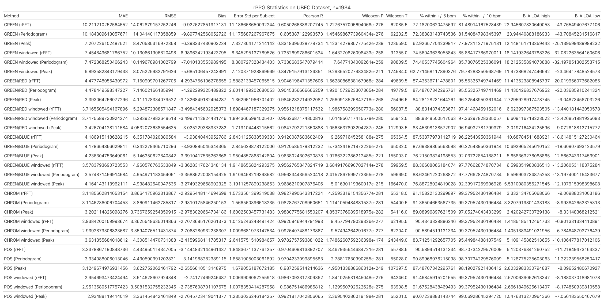

# Remote Photoplethysmography (rPPG) in Python

Remote photoplethysmography (rPPG) is the process of estimating physiological signals, such as heart rate, using nothing more than a standard RGB camera. While the idea appears simple (as you are simply detecting tiny color changes in the skin caused by blood circulation), building a reliable rPPG pipeline requires concepts from computer vision, signal processing, and biomedical imaging.

This repository is my personal exploration of rPPG. Rather than building a production-ready application, my goal was to understand how classical rPPG algorithms work, why they were designed the way they were, and what practical challenges arise when implementing them from scratch.

All algorithms in this repository are implemented directly in Python without relying on external rPPG libraries.

## Highlights
- Implemented five classical rPPG algorithms from scratch in Python
- Implemented both windowed and non-windowed variants
- Implemented multiple heart rate estimation methods (FFT, periodogram, and peak detection/IBI analysis)
- Built a complete signal processing pipeline from video to heart rate estimation
- Evaluated every pipeline on the UBFC-rPPG dataset
- Performed statistical analysis comparing algorithms, windowing strategies, and heart rate estimation methods

## Motivations
I’ve always been curious about how my heart rate changes throughout the day, whether than is just after waking up, while studying, exercising, or simply resting. Without owning a smartwatch, however, measuring my heart rate was only possible when using cardio equipment at the gym or other specialized devices.

While searching for project ideas, I discovered remote photoplethysmography (rPPG), a technique that estimates heart rate using only a conventional RGB camera. Unlike wearable devices that measure skin color changes through direct contact with the skin, rPPG observes those same physiological changes remotely using a camera positioned at a normal viewing distance, such as the webcam on a laptop.

This immediately caught my interest because it combined several areas that I wanted to learn more about:
- Biomedical signal processing
- Computer vision
- Image processing
- Spectral analysis
- Physiological signal analysis

Since I had no previous background in bioengineering, this project became an opportunity to learn these topics by implementing the underlying algorithms from the original research papers rather than treating them as black boxes.

## Implemented Methods
This repository implements several classical rPPG algorithms commonly used in the literature. Note that some algorithms like ICA and PCA have not yet been implemented.

| Method | Purpose |
| ---- | ---- |
| Green-Only | Baseline method using the green channel as a proxy for blood volume pulse |
| Green/Red Ratio | Reduces sensitivity to illumination changes using color ratios |
| Green/Blue Ratio | Alternative ratio-based approach |
| CHROM (Chrominance-Based) | Uses chrominance projection to suppress motion artifacts and specular reflections |
| POS (Plane-Orthogonal-to-Skin) | Projects color signals onto a plane orthogonal to skin tone to improve robustness |

Each algorithm is available in both windowed and non-windowed implementations.

Every method produces a one-dimensional Blood Volume Pulse (BVP) signal, which can then be used to estimate heart rate.

## Heart Rate Estimation
Three different approaches for estimating heart rate from the recovered BVP signal are implemented:
- Fast Fourier Transform (FFT)
- Periodogram-based Spectral Estimation (which functions very similarly to FFT)
- Peak Detection / Inter-Beat Interval analysis

Implementing multiple estimation methods made it possible to compare not only the rPPG algorithms themselves, but also how different heart rate estimation techniques interact with each algorithm.

## Evaluation
To compare the implemented methods, every pipeline was evaluated on the UBFC-rPPG dataset.

Each pipeline consists of three independent design choices:
- rPPG algorithm
- Windowed vs. non-windowed processing
- Heart rate estimated method

Videos were processed to obtain a BVP signal, which was then segmented into overlapping 10-second windows for heart rate estimation. Performance was evaluated using metrics including:
- Mean Absolute Error (MAE)
- Root Mean Squared Error (RMSE)
- Mean Error (Bias)
- Pearson Correlation
- Bland-Altman analysis

To determine whether observed differences were statistically significant, a three-way repeated-measures ANOVA was performed, followed by post-hoc pairwise testing.

## Results
Several interesting observations emerged from the evaluation.
- POS and CHROM consistently outperformed simpler approaches
- Green-only served as a useful baseline but generally produced the largest estimation errors.
- No single heart rate estimation method (FFT, periodogram, or peak detection) was universally best for every rPPG algorithm
- The best-performing pipeline was the windowed POS algorithm using peak detection, closely followed by windowed CHROM using FFT.

One of the most interesting findings was that there is no universally optimal pipeline. The best heart rate estimation depended on the underlying rPPG algorithm, highlighting the importance of considering the entire processing pipeline rather than evaluating each component independently. 



## Repository Structure
```
rPPG
├── main.py
├── results_analysis.py
├── evaluation.py
├── PPG.py
├── utils/
│   ├── methods.py
│   ├── post_processing.py
│   └── utils.py
├── results/
├── writeup-related/
│   └── Understanding_rPPG.md
└── README.md

main.py — Run the rPPG pipeline on recorded video.

results_analysis.py - View statistical results from the UBFC dataset

evaluation.py - View the code used to analyze UBFC dataset

PPG.py - View the code used to use PPG signals from the UBFC to derive ground truth heart rate

utils/ — Includes rPPG methods, heart rate estimation methods, and interactive graph methods.

results/ - Includes data from the UBFC dataset, including ground truth heart rate and estimated heart rate for each window/subject.

writeup-related/ — Figures and documentation assets.
```

## Usage
### Run the heart rate estimator
Configure the desired settings inside ```main.py```, then run:
```shell
python main.py 
```
The program records a video, extracts the facial color signals, reconstructs the BVP signal, and estimates heart rate using the pipelines.

### Reproduce the evaluation
To reproduce the statistical analysis performed on the UBFC-rPPG dataset, run:
```shell 
python results_analysis.py
```

## Documentation
This ```README``` provides a high-level overview of the project.

For readers interested in the physiological principles, signal processing techniques, and mathematical intuition behind each implemented algorithm, a more detailed write-up is available in:
```writeup_related/Understanding_rPPG.md```.

The documentation explains:
- How ECG, PPG, and rPPG differ
- Why skin color changes with each heartbeat
- Why the green channel is particularly informative
- Detrending and bandpass filtering
- Intuition behind each implemented algorithm
- Windowing strategies
- Heart rate estimation methods
- Evaluation methodology

## Dataset
Evaluation was performed using the UBFC-rPPG Dataset.
```
Bobbia, S., Macwan, R., Benezeth, Y., Mansouri, A., & Dubois, J. (2017). Unsupervised skin tissue segmentation for remote photoplethysmography. Pattern Recognition Letters.
```

## What I Learned
This project gave me hands-on experience with topics that I had never previously studied, including:
- Biomedical signal processing
- Fourier analysis and spectral estimation
- Motion artifact reduction
- Optical absorption in biological tissue
- Computer vision pipelines
- Statistical evaluation of machine learning and signal processing algorithms
- Implementing research papers directly from published methodology

More importantly, it reinforced the value of understanding why an algorithm works rather than simply reproducing published results. Implementing each method from scratch and comparing them under a common evaluation framework provided a much deeper understanding of the design trade-offs involved in remote physiological sensing.

